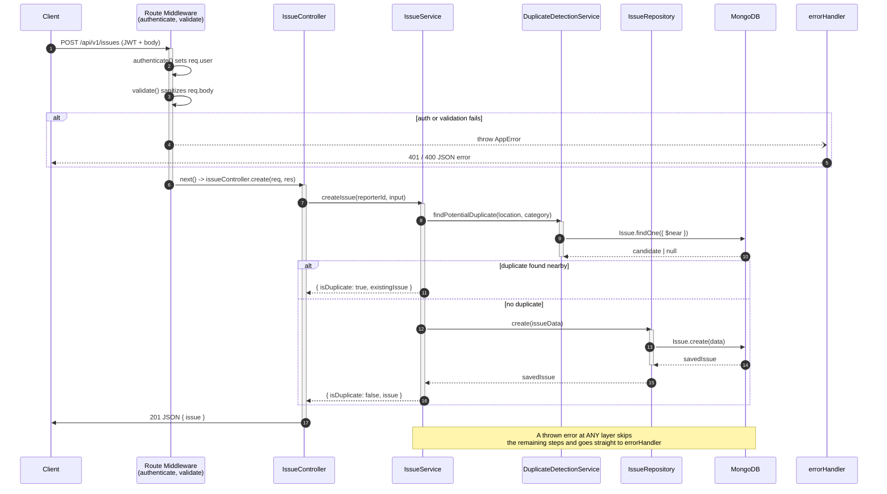

# CityPulse Backend — MVP (Phase 1)

Feature-based modular monolith, per your Architecture Decisions (ADR-001,
ADR-006, ADR-010–013). Layered as: **Route → Validate → Controller →
Service → Repository → MongoDB**.

## What's built in this pass

- **Identity module**: register (citizen self-signup only), login, JWT,
  `GET /me`
- **Issues module**: create (with geo-distance duplicate detection),
  get/list/filter, vote/unvote, status lifecycle (enforced as a state
  machine, not if/else), department assignment, soft delete
- **Departments module**: CRUD, category→department auto-suggestion
  (Hybrid Assignment, ADR-003)
- Shared layer: centralized error handling (`AppError` + `errorHandler`),
  JWT auth middleware, RBAC middleware, consistent response envelope

## Request Lifecycle

Every request follows the same path down through the layers, and the
return value travels back up through the exact same layers in reverse.
A thrown error at any point skips straight to `errorHandler` instead of
bubbling back up normally. Traced here for `POST /issues` (create an
issue, including duplicate detection):



Every other module follows this same shape: `routes -> controller ->
service -> repository -> MongoDB`, just with different players. Only the
**controller** ever calls `res.json()` (via `sendSuccess`) — nothing
below it touches `req`/`res` directly, which is what lets the repository
and service be reused or tested without any HTTP request involved at all.

## Not built yet (next pass)

- Notifications module (Socket.IO gateway)
- Analytics/dashboard aggregation endpoints
- Image upload (Cloudinary/multer wiring)
- Officer/Admin provisioning endpoints (admin creates officer accounts)
- Audit log collection (currently only Issue status history is tracked)
- Frontend (React)

## Setup

```bash
cd citypulse-backend
npm install
cp .env.example .env   # fill in MONGO_URI and JWT_SECRET at minimum
npm run dev             # requires nodemon; or `npm start`
```

You need a local or Atlas MongoDB instance. `MONGO_URI` in `.env.example`
points at `mongodb://127.0.0.1:27017/citypulse` for local Mongo.

## API quick reference

All routes are prefixed `/api/v1`.

### Auth
| Method | Path | Auth | Notes |
|---|---|---|---|
| POST | `/auth/register` | none | citizen only |
| POST | `/auth/login` | none | |
| GET | `/auth/me` | any | |

### Issues
| Method | Path | Auth | Notes |
|---|---|---|---|
| POST | `/issues` | any | runs duplicate detection first |
| GET | `/issues` | any | `?status=&category=&department=&page=&limit=` |
| GET | `/issues/:id` | any | |
| POST | `/issues/:id/vote` | citizen | |
| DELETE | `/issues/:id/vote` | citizen | |
| PATCH | `/issues/:id/status` | any | role checked against the lifecycle table |
| PATCH | `/issues/:id/assign` | admin | manual override |
| DELETE | `/issues/:id` | admin, citizen | soft delete |

### Departments
| Method | Path | Auth | Notes |
|---|---|---|---|
| POST | `/departments` | admin | |
| GET | `/departments` | any | |
| GET | `/departments/suggest?category=` | admin | |
| PATCH | `/departments/auto-assign/:issueId` | admin | applies the suggestion |

## Testing it manually (once running)

```bash
# Register
curl -X POST http://localhost:5000/api/v1/auth/register \
  -H "Content-Type: application/json" \
  -d '{"name":"Asha Rao","email":"asha@example.com","password":"password123"}'

# Login (grab the token from the response)
curl -X POST http://localhost:5000/api/v1/auth/login \
  -H "Content-Type: application/json" \
  -d '{"email":"asha@example.com","password":"password123"}'

# Report an issue (replace TOKEN)
curl -X POST http://localhost:5000/api/v1/issues \
  -H "Content-Type: application/json" \
  -H "Authorization: Bearer TOKEN" \
  -d '{"title":"Broken streetlight on 5th Ave","description":"Light has been out for a week","category":"streetlight","latitude":22.798,"longitude":86.184}'
```

## Why this structure (in case an interviewer asks)

- **Repository exists even though Mongoose already abstracts the DB**
  because it isolates persistence from business rules — see `2_System_Design.md`
  Step in your docs and ADR-012.
- **Status transitions live in a table (`STATUS_TRANSITIONS`)**, not
  scattered `if` statements, so the whole lifecycle is auditable in one
  place and easy to extend without touching controller code.
- **`authorize()` is deliberately dumb** (role-in-list check only).
  Anything context-dependent (e.g. "officer can only update issues in
  their own department") is a business rule and lives in the Service,
  not the middleware — keeps Role Separation (Principle 5) enforceable
  in one layer.
